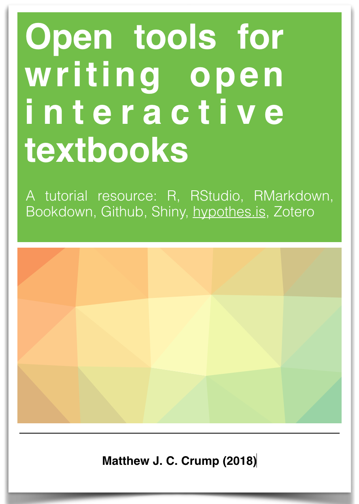

--- 
title: "Open tools for writing open interactive textbooks (and more)"
author: "Matthew Crump"
date: "2018: Last compiled `r Sys.Date()`"
site: bookdown::bookdown_site
output: 
  bookdown::gitbook:
    includes:
      in_header: includeme.html
documentclass: book
bibliography: [book.bib, packages.bib]
biblio-style: apalike
link-citations: yes
github-repo: CrumpLab/OER_bookdown
description: "A tutorial and working resources for writing open-source textbooks using open-source tools"
---

# Preface {-}

```{r,echo=F,fig.align="center",eval=T}

```

Crump, Matthew J. C. (2018). Open tools for writing open interactive textbooks (and more). https://crumplab.github.io/programmingforpsych/

This is a tutorial and set of working examples for creating web-based textbooks using a collection of open-source tools.

This web-book is itself a working example. All of the source code needed to compile this book yourself is included in the [github repository for this book](https://github.com/CrumpLab/OER_bookdown). So, you could download the repository, and by following the instructions laid out across the chapters, replace this text with your own, and then compile your book as a web-page, .pdf or epub.

Feel free to contribute to this tutorial by submitting pull requests to this repository.

**License CC BY-SA 4.0 license**

The book is released under a creative commons [CC BY-SA 4.0](https://creativecommons.org/licenses/by-sa/4.0/) license. This means that this book can be reused, remixed, retained, revised and redistributed (including commercially) as long as appropriate credit is given to the authors. If you remix, or modify the original version of this open textbook, you must redistribute all versions of this open textbook under the same license - CC BY-SA 4.0.


